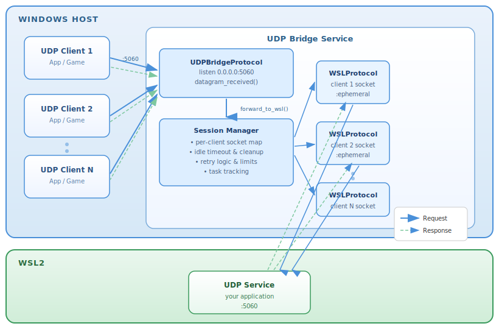
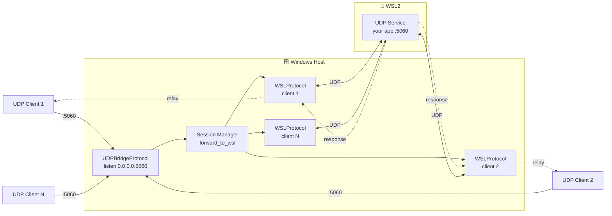
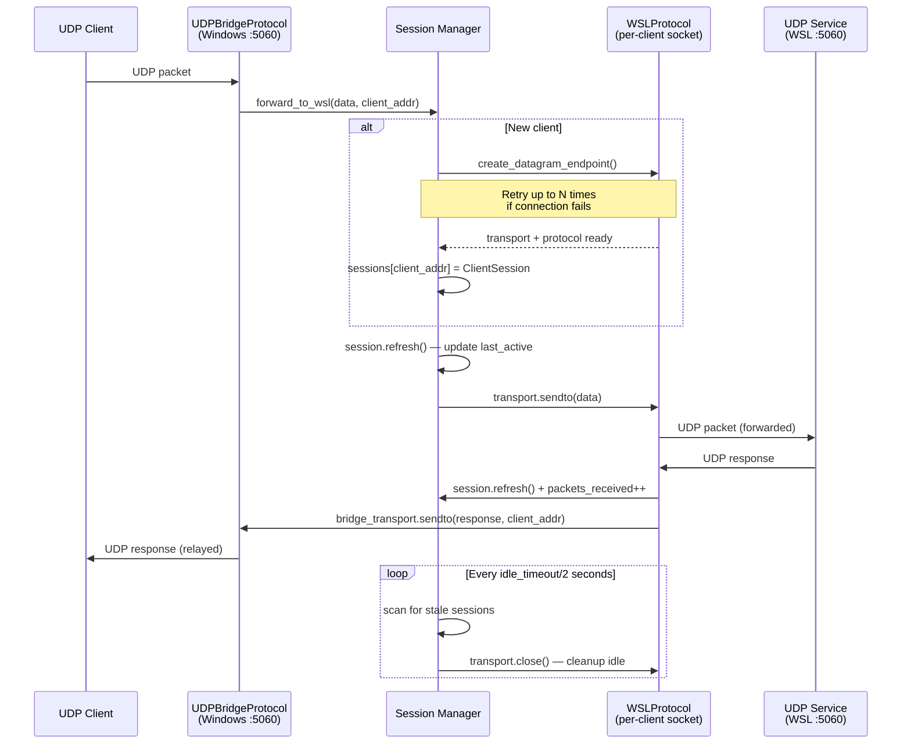

# 🚀 UDP Windows-to-WSL Port Bridge

> A production-ready async UDP bridge enabling seamless communication between Windows
> and WSL with enterprise-grade features.


------------------------------------------------------------------------

## 📌 Overview

Windows provides a built-in TCP port proxy:

```bash
netsh interface portproxy
```

However, **UDP is not supported**.

This project implements a **UDP port bridge** using Python and `asyncio`,
allowing Windows applications to communicate with UDP services running inside WSL.

------------------------------------------------------------------------

## 📋 Table of Contents

- [📌 Overview](#-overview)
- [✨ Features](#-features)
- [🎬 Quick Demo](#-quick-demo)
- [🏗 Architecture](#-architecture)
- [🔎 How It Works](#-how-it-works)
- [⚙️ Installation](#️-installation)
- [▶️ Usage](#️-usage)
- [📊 Monitoring & Logging](#-monitoring--logging)
- [🧪 Running Tests](#-running-tests)
- [🧠 Design Decisions](#-design-decisions)
- [🛠 Use Cases](#-use-cases)
- [🐛 Troubleshooting](#-troubleshooting)
- [📄 License](#-license)
- [⭐ Contributing](#-contributing)
- [🔗 Related Projects](#-related-projects)

------------------------------------------------------------------------

## ✨ Features

- 🔄 UDP forwarding (Windows → WSL)
- ⚡ Fully asynchronous (`asyncio`)
- 👥 Per-client session isolation
- 🧹 Automatic idle session cleanup
- 📦 Zero external dependencies
- 🧵 Supports concurrent UDP clients
- 🪶 Lightweight & efficient
- 🛡️ DoS protection (session limits)
- 🔁 Connection retry logic
- 📊 Session statistics & monitoring
- 📝 Structured logging with levels
- ✅ Configuration validation
- 🪟 Windows-optimized (Ctrl+C graceful shutdown)

------------------------------------------------------------------------

## 🎬 Quick Demo

```powershell
# Terminal 1 (WSL): Start a UDP listener
wsl -e bash -c "nc -u -l -p 5060"

# Terminal 2 (Windows): Start the bridge
python -m udp_win_wsl_bridge --log-level DEBUG

# Terminal 3 (Windows): Send a test packet
python -c "import socket; s=socket.socket(socket.AF_INET, socket.SOCK_DGRAM); s.sendto(b'Hello WSL!', ('127.0.0.1', 5060))"
```

You should see `Hello WSL!` appear in Terminal 1.

------------------------------------------------------------------------

## 🏗 Architecture

### Component Diagram



### Data Flow



------------------------------------------------------------------------

## 🔎 How It Works

### Packet Flow (Sequence Diagram)



------------------------------------------------------------------------

## ⚙️ Installation

### Requirements

- **Python 3.8+**
- **Windows 10/11** with WSL2 installed
- **A WSL instance** running the UDP service you want to bridge to

### Quick Start (no install needed)

```powershell
# Clone the repository
git clone https://github.com/stanisln/WindowsWslPortBridge.git
cd WindowsWslPortBridge

# Run directly — no pip install required
python -m udp_win_wsl_bridge
```

### Install as a Package (gives you the `udp-bridge` command)

```powershell
pip install -e .
udp-bridge --help
```

### Install with dev dependencies (for running tests and linting)

```powershell
pip install -e .[dev]
```

### No External Dependencies

This bridge uses only Python standard library modules — no `pip install` required to run!

### Project Structure

```
WindowsWslPortBridge/
├── .gitignore
├── LICENSE
├── README.md
├── requirements.txt
├── pyproject.toml
├── docs/
│   └── images/
│       └── architecture.svg        ← component diagram
├── tests/                          ← test suite (64 tests)
│   ├── __init__.py
│   ├── test_cli.py                 # CLI argument parsing & config creation
│   ├── test_config_and_utils.py    # BridgeConfig validation, detect_wsl_ip, logging
│   ├── test_protocols.py           # UDPBridgeProtocol & WSLProtocol
│   └── test_service.py             # UDPBridgeService (session lifecycle, shutdown)
└── udp_win_wsl_bridge/             ← installable package
    ├── __init__.py                 # Package exports
    ├── __main__.py                 # Entry point (supports both run modes)
    ├── cli.py                      # Argument parsing
    ├── config.py                   # Configuration dataclass & validation
    ├── logging_utils.py            # Logging setup
    ├── models.py                   # ClientSession data model
    ├── protocols.py                # asyncio DatagramProtocol implementations
    ├── service.py                  # Main UDPBridgeService
    └── utils.py                    # WSL IP auto-detection
```

------------------------------------------------------------------------

## ▶️ Usage

### Basic Usage

```powershell
# From inside the WindowsWslPortBridge\ folder
python -m udp_win_wsl_bridge
```

You can also run the file directly from anywhere:

```powershell
python C:\path\to\udp_win_wsl_bridge\__main__.py
```

### Custom WSL IP

```powershell
python -m udp_win_wsl_bridge --wsl-host 172.25.224.1
```

### Custom Ports

```powershell
python -m udp_win_wsl_bridge --listen-port 9000 --wsl-port 9000
```

### Advanced Configuration

```powershell
python -m udp_win_wsl_bridge --listen-port 5060 --wsl-port 5060 --timeout 30 --max-sessions 5000 --log-level INFO
```

### Debug Mode

```powershell
python -m udp_win_wsl_bridge --log-level DEBUG
```

### All Parameters

| Argument           | Description                                   | Default |
|--------------------|-----------------------------------------------|---------|
| `--wsl-host`       | WSL IP address (auto-detected if omitted)     | auto    |
| `--listen-port`    | UDP port to listen on (Windows side)          | `5060`  |
| `--wsl-port`       | Target UDP port inside WSL                    | `5060`  |
| `--timeout`        | Idle session timeout in seconds               | `5.0`   |
| `--max-sessions`   | Maximum concurrent sessions                   | `1000`  |
| `--retry-attempts` | Max connection attempts per session (min 1)   | `3`     |
| `--retry-delay`    | Delay between retry attempts in seconds       | `1.0`   |
| `--log-level`      | Logging level: DEBUG / INFO / WARNING / ERROR | `INFO`  |

------------------------------------------------------------------------

## 📊 Monitoring & Logging

### Log Levels

- **DEBUG** — detailed packet flow, per-session stats every cleanup cycle
- **INFO** — session creation, shutdown events
- **WARNING** — retry attempts, session limit reached
- **ERROR** — connection failures, unexpected errors

### Example Output

```
[2026-02-24 12:00:00] INFO: Listening on ('0.0.0.0', 5060) -> WSL 172.25.224.1:5060
[2026-02-24 12:00:01] INFO: Starting UDP bridge: 5060 -> 172.25.224.1:5060
[2026-02-24 12:00:05] INFO: Session created: ('192.168.1.100', 12345) (total: 1)
[2026-02-24 12:00:05] DEBUG: 192.168.1.100:12345 -> WSL (42 bytes)
[2026-02-24 12:00:05] DEBUG: WSL -> ('192.168.1.100', 12345) (42 bytes)
[2026-02-24 12:00:15] DEBUG: Active sessions: 1/1000, Total packets: 5 sent, 5 received
[2026-02-24 12:00:30] INFO: Shutting down bridge
[2026-02-24 12:00:30] INFO: Final stats: 1 sessions created, 5 packets sent, 5 packets received
```

### Graceful Shutdown

Press **Ctrl+C** to shut down cleanly — all active sessions are closed, pending
packets are flushed, and final statistics are printed.

------------------------------------------------------------------------

## 🧪 Running Tests

```powershell
# Install dev dependencies first
pip install -e .[dev]

# Run all tests
pytest

# Run with verbose output
pytest -v


# Run a specific test file
pytest tests/test_service.py
pytest tests/test_protocols.py
pytest tests/test_cli.py
pytest tests/test_config_and_utils.py
```

### Test Suite Coverage

| Test file | What it covers | Tests |
|---|---|---|
| `test_config_and_utils.py` | `BridgeConfig` validation, `detect_wsl_ip`, `setup_logging` | 21 |
| `test_service.py` | Session lifecycle, retry logic, cleanup loop, shutdown | 25 |
| `test_protocols.py` | `UDPBridgeProtocol` & `WSLProtocol` behaviour | 10 |
| `test_cli.py` | Argument parsing, config creation, error exits | 8 |
| **Total** | **All modules** | **64** |

------------------------------------------------------------------------

## 🧠 Design Decisions

### Why per-client session mapping?

UDP is connectionless, but most protocols follow a request-response pattern.
Mapping one outbound socket per client prevents packet mixing between clients,
session state conflicts, and response routing errors.

### Why asyncio?

Non-blocking I/O lets a single thread handle many concurrent clients efficiently,
with minimal memory overhead and a clean event-driven structure.

### Why track forwarding tasks explicitly?

`asyncio.create_task()` without storing a reference allows the event loop to
garbage-collect tasks before they finish, silently dropping packets. Every
forwarding task is held in `_pending_tasks` and removed only on completion.

------------------------------------------------------------------------

## 🛠 Use Cases

- 🎮 Game server development inside WSL
- 📡 SIP / RTP testing
- 🌐 DNS service testing
- 📊 Telemetry & metrics pipelines
- 🔬 Custom UDP protocol development

------------------------------------------------------------------------

## 🐛 Troubleshooting

### "Port already in use" (WinError 10048)

```powershell
# Find what is using the port
netstat -ano | findstr :5060

# Kill it (replace 1234 with the actual PID)
taskkill /PID 1234 /F

# Or use a different port
python -m udp_win_wsl_bridge --listen-port 5061
```

### "ImportError: attempted relative import with no known parent package"

You ran `python __main__.py` from inside the `udp_win_wsl_bridge\` folder.
Run from the **parent** folder instead:

```powershell
# Correct — from WindowsWslPortBridge\
python -m udp_win_wsl_bridge

# Also works — full path to the file
python C:\path\to\udp_win_wsl_bridge\__main__.py
```

### "WSL hostname command timed out" / auto-detect fails

```powershell
# Get your WSL IP manually
wsl hostname -I

# Pass it explicitly
python -m udp_win_wsl_bridge --wsl-host 172.25.224.1
```

### "Session limit reached"

```powershell
python -m udp_win_wsl_bridge --max-sessions 5000 --log-level DEBUG
```

### "Failed to create session after N attempts"

```powershell
# Increase retries and make sure your WSL service is running first
python -m udp_win_wsl_bridge --retry-attempts 5 --retry-delay 2.0
```

### General debugging

```powershell
python -m udp_win_wsl_bridge --log-level DEBUG
```

------------------------------------------------------------------------

## 📄 License

MIT License — see [LICENSE](LICENSE) for details.

**Author**: Stanislav Nikolaievskyi
**Version**: 1.0.0

------------------------------------------------------------------------

## ⭐ Contributing

Contributions, issues, and feature requests are welcome!

### Development Setup

```powershell
git clone https://github.com/stanisln/WindowsWslPortBridge.git
cd WindowsWslPortBridge
pip install -e .[dev]
pytest
```

### Submitting Changes

1. Fork the repository
2. Create a feature branch
3. Add or update tests for your change
4. Submit a pull request

If you find this useful, consider giving it a ⭐ on GitHub!

------------------------------------------------------------------------

## 🔗 Related Projects

- [netsh interface portproxy](https://learn.microsoft.com/en-us/windows-server/networking/technologies/netsh/netsh-interface-portproxy) — Built-in Windows TCP port proxy (no UDP support)
- [WSL2 networking](https://learn.microsoft.com/en-us/windows/wsl/networking) — Official WSL networking documentation
